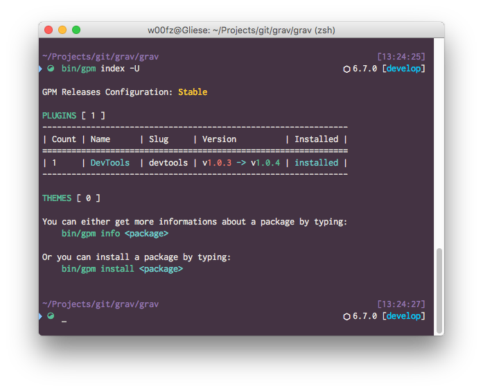

# My Oh-My-Zsh Theme



This theme is based on [Bureau](https://github.com/robbyrussell/oh-my-zsh/wiki/Themes#bureau) and modified. It supports Git and NPM.

## Install and Enable

To install the theme, copy the [`w00fz-bureau.zsh-theme`](w00fz-bureau.zsh-theme) file under `~/.zshrc/themes`.
Then, to enable it, set `ZSH_THEME` to `w00fz-bureau` in your `~/.zshrc`, before sourcing Oh My Zsh.

## Colors Palette

I use [iTerm2](https://www.iterm2.com/) as terminal of choice on my mac. If you like my palette, you can import the [w00fz.itermcolors](w00fz.itemrcolors) that is available in this repo.

# My Oh-My-Zsh Plugins
```
plugins=(git brew encode64 phing colorize copydir copyfile dirhistory autojump web-search osx)
[[ -s $(brew --prefix)/etc/profile.d/autojump.sh ]] && . $(brew --prefix)/etc/profile.d/autojump.sh
```

# Bonus: Yarn > NPM

An alias that forces `npm install` to be shifted to `yarn`.

```zshrc
npm() { if [[ $@ == "i" || $@ == "install" ]]; then command yarn; else command npm "$@"; fi; }
```
